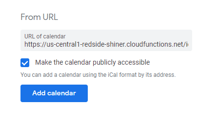

# Standard Feeds for the Web

The web is far more than just pages built in HTML. The idea of a "Web 3.0",
also known as the [Semantic Web](https://en.wikipedia.org/wiki/Semantic_Web)
doesn't just produce visual markup but also machine readable information on
the specific topic. This adds to the web's richness and makes the content
more useful.

In lieu of wider adoption, this tool provides a series of webhook-based
transformations for common public knowledge into more standardized formats
based on the particular context.

To be specific, this provides transformations to
* [iCalendar format (RFC 5545)](https://icalendar.org/RFC-Specifications/iCalendar-RFC-5545/)
* RSS (tested in Feedly)

The list of available feeds will continually be added in `functions/src/feeds/`
while you can view everything from `functions/src/index.ts`.

## How to Use

There are hosted versions of each of the existing feeds.

### RSS

* Open up your RSS reader of choice
* Select new feed
* Point to one of the URLs below


#### RSS Feeds

* [Legislation on President's Desk](https://us-central1-redside-shiner.cloudfunctions.net/rss_congress)
* [serebii.net](https://us-central1-redside-shiner.cloudfunctions.net/rss_serebii)

### Calendars

The way that the calendar function works is by supporting a list of calendar
names as a query parameter. You can add multiple modules into a single feed
if you want.

If you want to view the content in a web browser rather than downloading the calendar, append `&debug=true` to the end of the URL.

* Open up your calendar app of choice
* Add a new calendar by URL
* Point to one of the URLs below



#### Calendars

* [Angelika Theater](https://us-central1-redside-shiner.cloudfunctions.net/ical_fetch?c[]=angelkia)
* [Angular NYC](https://us-central1-redside-shiner.cloudfunctions.net/ical_fetch?c[]=angularnyc)
* [Arthouse Hotel](https://us-central1-redside-shiner.cloudfunctions.net/ical_fetch?c[]=arthouse)
* [Barclays Center](https://us-central1-redside-shiner.cloudfunctions.net/ical_fetch?c[]=barclays)
* [The Bell House](https://us-central1-redside-shiner.cloudfunctions.net/ical_fetch?c[]=bellhouse)
* [BRIC](https://us-central1-redside-shiner.cloudfunctions.net/ical_fetch?c[]=bric)
* [Brooklyn Steel](https://us-central1-redside-shiner.cloudfunctions.net/ical_fetch?c[]=brooklynsteel)
* [NYC Parks](https://us-central1-redside-shiner.cloudfunctions.net/ical_fetch?c[]=cityparks)
* [NYC City Winery](https://us-central1-redside-shiner.cloudfunctions.net/ical_fetch?c[]=citywinery)
* [Carnegie Hall](https://us-central1-redside-shiner.cloudfunctions.net/ical_fetch?c[]=carnegiehall)
* [Caveat](https://us-central1-redside-shiner.cloudfunctions.net/ical_fetch?c[]=caveat)
* [Columbia](https://us-central1-redside-shiner.cloudfunctions.net/ical_fetch?c[]=columbia)
* [Coney Island](https://us-central1-redside-shiner.cloudfunctions.net/ical_fetch?c[]=coneyisland)
* [Disco Nap](https://us-central1-redside-shiner.cloudfunctions.net/ical_fetch?c[]=disconap)
* [The Django](https://us-central1-redside-shiner.cloudfunctions.net/ical_fetch?c[]=django)
* [Downtown Brooklyn](https://us-central1-redside-shiner.cloudfunctions.net/ical_fetch?c[]=downtownbrooklyn)
* [Elsewhere](https://us-central1-redside-shiner.cloudfunctions.net/ical_fetch?c[]=elsewhere)
* [Flutter New York](https://us-central1-redside-shiner.cloudfunctions.net/ical_fetch?c[]=flutternyc)
* [Forest Hills Stadium](https://us-central1-redside-shiner.cloudfunctions.net/ical_fetch?c[]=foresthills)
* [Freehold Brookyln](https://us-central1-redside-shiner.cloudfunctions.net/ical_fetch?c[]=freehold)
* [Google Developer Group - Hoboken](https://us-central1-redside-shiner.cloudfunctions.net/ical_fetch?c[]=gdghoboken)
* [Google Developer Group - NYC](https://us-central1-redside-shiner.cloudfunctions.net/ical_fetch?c[]=gdgnyc)
* [Google Developer Group - Cloud - NYC](https://us-central1-redside-shiner.cloudfunctions.net/ical_fetch?c[]=gdgcloudnyc)
* [Grimm Ales](https://us-central1-redside-shiner.cloudfunctions.net/ical_fetch?c[]=grimmales)
* [Hudson Yards](https://us-central1-redside-shiner.cloudfunctions.net/ical_fetch?c[]=hudsonyards)
* [Irving Plaza](https://us-central1-redside-shiner.cloudfunctions.net/ical_fetch?c[]=irvingplaza)
* [KGB Bar](https://us-central1-redside-shiner.cloudfunctions.net/ical_fetch?c[]=kgbbar)
* [King's Theatre](https://us-central1-redside-shiner.cloudfunctions.net/ical_fetch?c[]=kingstheatre)
* [Lincoln Center](https://us-central1-redside-shiner.cloudfunctions.net/ical_fetch?c[]=lincolncenter)
* [Little Island](https://us-central1-redside-shiner.cloudfunctions.net/ical_fetch?c[]=littleisland)
* [Live Code NYC](https://us-central1-redside-shiner.cloudfunctions.net/ical_fetch?c[]=livecode)
* [LPR](https://us-central1-redside-shiner.cloudfunctions.net/ical_fetch?c[]=lpr)
* [MarketWatch](https://us-central1-redside-shiner.cloudfunctions.net/ical_fetch?c[]=marketwatch)
* [Madison Square Garden](https://us-central1-redside-shiner.cloudfunctions.net/ical_fetch?c[]=msg)
* [Music Hall of Williamsburg](https://us-central1-redside-shiner.cloudfunctions.net/ical_fetch?c[]=musichallwilliamsburg)
* [My Cheeky Date](https://us-central1-redside-shiner.cloudfunctions.net/ical_fetch?c[]=mycheekydate)
* [Nerd Nite NYC](https://us-central1-redside-shiner.cloudfunctions.net/ical_fetch?c[]=nerdnite)
* [New Liberals NYC](https://us-central1-redside-shiner.cloudfunctions.net/ical_fetch?c[]=newliberalsnyc)
* [New York Minute Dating](https://us-central1-redside-shiner.cloudfunctions.net/ical_fetch?c[]=nyminute)
* [NYC Philharmonic](https://us-central1-redside-shiner.cloudfunctions.net/ical_fetch?c[]=philharmonic)
* [NYC Public Theater](https://us-central1-redside-shiner.cloudfunctions.net/ical_fetch?c[]=publictheater)
* [Pokémon League (Near NYC)](https://us-central1-redside-shiner.cloudfunctions.net/ical_fetch?c[]=pokemonleague)
* [Summer on the Hudson](https://us-central1-redside-shiner.cloudfunctions.net/ical_fetch?c[]=summerhudson)
* [Summer Stage](https://us-central1-redside-shiner.cloudfunctions.net/ical_fetch?c[]=summerstage)
* [Sundae Sauuce](https://us-central1-redside-shiner.cloudfunctions.net/ical_fetch?c[]=sundaesauuce)
* [Timeout Market](https://us-central1-redside-shiner.cloudfunctions.net/ical_fetch?c[]=timeoutmarket)
* [Town Hall](https://us-central1-redside-shiner.cloudfunctions.net/ical_fetch?c[]=townhall)
* [Triad Theater](https://us-central1-redside-shiner.cloudfunctions.net/ical_fetch?c[]=triadtheater)
* [Ukrainian Institute of America](https://us-central1-redside-shiner.cloudfunctions.net/ical_fetch?c[]=ukraineinstitute)
* [Victory Den](https://us-central1-redside-shiner.cloudfunctions.net/ical_fetch?c[]=victoryden)
* [NYC Voice Assistant Meetup](https://us-central1-redside-shiner.cloudfunctions.net/ical_fetch?c[]=voicenyc)
* [Wallace Lounge](https://us-central1-redside-shiner.cloudfunctions.net/ical_fetch?c[]=wallacelounge)
* [Webster Hall](https://us-central1-redside-shiner.cloudfunctions.net/ical_fetch?c[]=websterhall)
* [Wonderville](https://us-central1-redside-shiner.cloudfunctions.net/ical_fetch?c[]=wonderville)

## Setup

* Download the repostiory from GitHub
* `cd functions`
* `npm install`
* `npm run build`
* `npm run deploy`

If you run `npm run demo` it will run the logic in `functions/src/demo.ts`,
which can be useful for testing out a specific feed prior to deployment.

iCalendar feeds depend on `functions/src/feesd/ical.ts`.
RSS feeds depend on `functions/src/feeds/rss.ts`.

Each separate feed exists as an independent module. All modules are imported into `functions/src/index.ts` and exported using Firebase Functions.

Whenever a function is called, the page is grabbed at that moment. There is no caching layer. At scale, there should be.

## Library

You can install the underlying types to use the standard objects in your own
applications:

```
npm install --save @fleker/standard-feeds
```

See lib/README.md for more information on the APIs and their usage.

### Testing

Future work includes adding automated or manual monitoring of changes to
the webpages.
